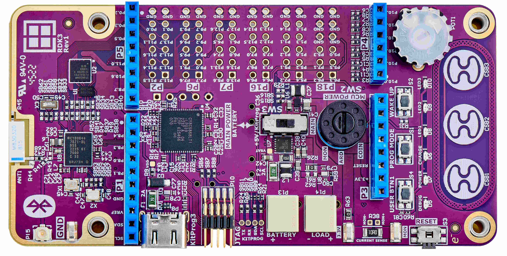

# RDK3 BLE Find Me Code Example

Rutronik Development Kit 3 Programmable System-on-Chip CYB06447BZI-BLD53 "RDK3  Bluetooth LE Find Me" Code Example. 

This is a typical code example that demonstrates a custom BLE “Find Me” Profile. Please refer to [CE217637 - BLE Find Me Profile with PSoC 6 MCU with BLE Connectivity](https://www.infineon.com/dgdl/Infineon-CE217637_Bluetooth_Low_Energy_Find_Me_Profile_with_PSoC_6_MCU_with_Bluetooth_Low_Energy_Connectivity-Code Example-v02_00-EN.pdf?fileId=8ac78c8c7d0d8da4017d0e73c6510607). 

 

## Requirements

- [ModusToolbox™ software](https://www.cypress.com/products/modustoolbox-software-environment) v3.0

## The Provisioning of the RDK3

The CYB06447BZI-BLD53 device must be provisioned with keys and policies before being programmed. If the kit is already provisioned, copy-paste the keys and policy folder to the application folder. If the unsigned or not properly signed image will be written to the RDK3 PSoC™ 64 – the microcontroller will not boot. 

The “[Secure Policy Configurator](https://www.infineon.com/dgdl/Infineon-ModusToolbox_Secure_Policy_Configurator_1.30_User_Guide-UserManual-v01_00-EN.pdf?fileId=8ac78c8c8386267f0183a960762a5977)” tool is used for the provisioning of the new RDK3, please refer to the “ModusToolbox™ Secure Policy Configurator user guide”. 

The CYB06447BZI-BLD53 MCU must be powered from a 2.5V power source to be able to complete the provisioning. The RDK3 has an SMPS [Switching Mode Power Supply] which can be easily adjusted to provide 3.3V or 2.5V to the MCU by switching the slide-switch “SW1” on the bottom side of the board. 

Please note that the “[Secure Policy Configurator](https://www.infineon.com/dgdl/Infineon-ModusToolbox_Secure_Policy_Configurator_1.30_User_Guide-UserManual-v01_00-EN.pdf?fileId=8ac78c8c8386267f0183a960762a5977) 1.20” requires the KitProg3 to be set into the CMSIS-DAP mode. Please press the “PROG MODE” button on the RDK3 board's front side once. The DEBUG D5 yellow led will flash indicating the CMSIS-MODE activated.

### Using the code example with a ModusToolbox™ IDE:

1. Import the project: **File** > **Import...** > **General** > **Existing Projects into Workspace** > **Next**.
2. Select the directory where **"RDK3_BLE_Find_Me"** resides and click  **Finish**.
3. Update the libraries using a **"Library Manager"** tool.
4. Select and build the project **Project ** > **Build Project**.

### Operation

The yellow LED1 will toggle every time the advertisement event occurs. The MCU is in low-power mode between the advertisement events. If a client is connected the yellow LED1 will be on constantly and the green LED2 will be switched depending on the “Alert Level” received from a client:

- “Alert Level” = “No Alert” [0x00] → The LED2 is OFF.
- “Alert Level” = “Mild Alert” [0x01] → The LED2 is BLINKING.
- “Alert Level” = “High Alert” [0x02] → The LED2 is ON.

The Characteristic “Alert Level” is written by the client application using the “Immediate Alert” Service. For example, a “CySmart” application on the Android phone was used to connect to the RDK3 BLE Server “BLE Findme Target”.

### Debugging

If you successfully have imported the example, the debug configurations are already prepared to use with a the KitProg3, MiniProg4, or J-link. Open the ModusToolbox™ perspective and find the Quick Panel. Click on the desired debug launch configuration and wait for the programming to complete and the debugging process to start.

## Legal Disclaimer

The evaluation board including the software is for testing purposes only and, because it has limited functions and limited resilience, is not suitable for permanent use under real conditions. If the evaluation board is nevertheless used under real conditions, this is done at one’s responsibility; any liability of Rutronik is insofar excluded. 

